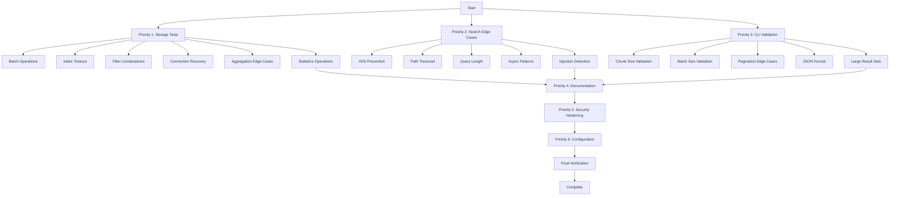

# SecondBrain Code Quality Improvements - Implementation Plan

## Executive Summary

This document provides a detailed, actionable implementation plan for achieving 95%+ test coverage and comprehensive code quality improvements across the SecondBrain Python CLI project.

**Current State:**
- Overall Coverage: 85%
- Storage Module: 64% (critical gap)
- Search Module: 83% (edge cases missing)
- CLI Module: 91% (validation edge cases missing)

**Target State:**
- Overall Coverage: 95%+
- All modules: 90%+ coverage
- Zero security vulnerabilities
- Comprehensive documentation

---

## Priority 1: Storage Module Tests (64% → 90%+)

### Overview
The Storage module handles MongoDB vector storage operations. Current tests cover basic CRUD but miss critical edge cases, batch operations, and async patterns.

### Test Files to Create/Modify
- `tests/test_storage/test_storage.py` - Extend existing file
- `tests/test_storage/test_batch_operations.py` - NEW
- `tests/test_storage/test_connection_recovery.py` - NEW
- `tests/test_storage/test_aggregation_edge_cases.py` - NEW

### Detailed Test Cases

#### 1.1 Batch Insert Operations (File: `tests/test_storage/test_batch_operations.py`)

| Test Case | Method | Description | Priority | Effort |
|-----------|--------|-------------|----------|--------|
| `test_store_batch_empty_list` | `store_batch` | Verify behavior with empty document list | P0 | 15min |
| `test_store_batch_single_document` | `store_batch` | Single document batch insert | P0 | 15min |
| `test_store_batch_large_batch` | `store_batch` | Test with 100+ documents | P0 | 20min |
| `test_store_batch_timestamps_consistent` | `store_batch` | Verify all docs get same timestamp | P1 | 20min |
| `test_store_batch_preserves_metadata` | `store_batch` | Verify metadata integrity | P1 | 15min |
| `test_store_batch_partial_failure` | `store_batch` | Handle partial insert failures | P1 | 30min |
| `test_store_batch_with_invalid_embedding` | `store_batch` | Handle invalid embedding format | P2 | 20min |
| `test_store_batch_returns_correct_count` | `store_batch` | Verify return value accuracy | P0 | 10min |

**Verification Steps:**
```bash
pytest tests/test_storage/test_batch_operations.py -v
pytest --cov=secondbrain.storage --cov-report=term-missing
```

#### 1.2 Index Ready Timeout Scenarios (File: `tests/test_storage/test_storage.py` - extend)

| Test Case | Method | Description | Priority | Effort |
|-----------|--------|-------------|----------|--------|
| `test_wait_for_index_timeout` | `_wait_for_index_ready` | Verify timeout after max retries | P0 | 25min |
| `test_wait_for_index_success_before_timeout` | `_wait_for_index_ready` | Index becomes ready before timeout | P0 | 20min |
| `test_wait_for_index_retry_logic` | `_wait_for_index_ready` | Verify retry count and delay | P1 | 25min |
| `test_wait_for_index_async_timeout` | `_wait_for_index_ready_async` | Async version timeout test | P0 | 25min |
| `test_wait_for_index_exception_handling` | `_wait_for_index_ready` | Handle exceptions during check | P1 | 20min |

**Verification Steps:**
```bash
pytest tests/test_storage/test_storage.py::TestVectorStorage::test_wait_for_index_timeout -v
pytest --cov=secondbrain.storage --cov-report=term-missing
```

#### 1.3 Filter Combination Testing (File: `tests/test_storage/test_aggregation_edge_cases.py`)

| Test Case | Method | Description | Priority | Effort |
|-----------|--------|-------------|----------|--------|
| `test_search_with_both_filters` | `search` | Test source + file_type filter combo | P0 | 20min |
| `test_search_with_regex_source_filter` | `search` | Regex pattern in source filter | P1 | 20min |
| `test_search_with_empty_results_filter` | `search` | Filter produces no results | P0 | 15min |
| `test_list_chunks_combined_filters` | `list_chunks` | Multiple filter conditions | P1 | 20min |
| `test_filter_case_sensitivity` | Various | Verify case handling in filters | P2 | 15min |

**Verification Steps:**
```bash
pytest tests/test_storage/test_aggregation_edge_cases.py -v
```

#### 1.4 Connection Recovery Mechanisms (File: `tests/test_storage/test_connection_recovery.py`)

| Test Case | Method | Description | Priority | Effort |
|-----------|--------|-------------|----------|--------|
| `test_connection_failure_recovery` | `validate_connection` | Recover after connection failure | P0 | 30min |
| `test_connection_cache_invalidation` | `validate_connection` | Cache invalidation on failure | P0 | 25min |
| `test_async_connection_recovery` | `validate_connection_async` | Async recovery patterns | P0 | 30min |
| `test_connection_pool_exhaustion` | Various | Handle connection pool limits | P1 | 35min |
| `test_reconnection_after_close` | `close` + reconnect | Verify reconnection after close | P1 | 25min |
| `test_context_manager_connection` | `__enter__/__exit__` | Context manager patterns | P0 | 20min |

**Verification Steps:**
```bash
pytest tests/test_storage/test_connection_recovery.py -v
```

#### 1.5 MongoDB Aggregation Edge Cases (File: `tests/test_storage/test_aggregation_edge_cases.py`)

| Test Case | Method | Description | Priority | Effort |
|-----------|--------|-------------|----------|--------|
| `test_aggregation_pipeline_order` | `search` | Verify pipeline stage order | P0 | 20min |
| `test_aggregation_with_large_resultset` | `search` | Handle 1000+ results | P1 | 25min |
| `test_aggregation_score_accuracy` | `search` | Verify score calculation | P1 | 20min |
| `test_aggregation_null_field_handling` | Various | Handle null/missing fields | P0 | 20min |
| `test_aggregation_with_special_characters` | Various | Special chars in queries | P1 | 15min |

**Verification Steps:**
```bash
pytest tests/test_storage/test_aggregation_edge_cases.py -v
```

#### 1.6 Statistics and Metadata Operations (File: `tests/test_storage/test_storage.py` - extend)

| Test Case | Method | Description | Priority | Effort |
|-----------|--------|-------------|----------|--------|
| `test_get_stats_empty_database` | `get_stats` | Stats with zero documents | P0 | 15min |
| `test_get_stats_with_many_sources` | `get_stats` | Stats with 100+ unique sources | P1 | 20min |
| `test_statistics_consistency` | `get_stats` | Verify count accuracy | P1 | 20min |
| `test_metadata_ingestion_timestamp` | `store` | Verify timestamp format | P0 | 15min |
| `test_metadata_preservation` | `store` + `list_chunks` | Metadata round-trip | P1 | 20min |

**Verification Steps:**
```bash
pytest tests/test_storage/test_storage.py -k "stats" -v
```

---

## Priority 2: Search Module Edge Cases (83% → 95%+)

### Overview
The Search module handles semantic search with query sanitization. Missing tests for security edge cases and async patterns.

### Test Files to Create/Modify
- `tests/test_search/test_searcher.py` - Extend existing file
- `tests/test_search/test_query_sanitization.py` - NEW
- `tests/test_search/test_async_patterns.py` - NEW

### Detailed Test Cases

#### 2.1 Query Sanitization - XSS Prevention (File: `tests/test_search/test_query_sanitization.py`)

| Test Case | Function | Description | Priority | Effort |
|-----------|----------|-------------|----------|--------|
| `test_sanitize_rejects_script_tags` | `sanitize_query` | Detect `<script>` injection | P0 | 15min |
| `test_sanitize_rejects_javascript_protocol` | `sanitize_query` | Detect `javascript:` protocol | P0 | 15min |
| `test_sanitize_rejects_event_handlers` | `sanitize_query` | Detect `onerror=`, `onclick=` | P1 | 15min |
| `test_sanitize_allows_safe_html` | `sanitize_query` | Allow safe HTML entities | P2 | 20min |
| `test_sanitize_handles_nested_tags` | `sanitize_query` | Nested injection attempts | P1 | 20min |

**Verification Steps:**
```bash
pytest tests/test_search/test_query_sanitization.py -k "xss" -v
```

#### 2.2 Query Sanitization - Path Traversal Prevention (File: `tests/test_search/test_query_sanitization.py`)

| Test Case | Function | Description | Priority | Effort |
|-----------|----------|-------------|----------|--------|
| `test_sanitize_rejects_path_traversal` | `sanitize_query` | Detect `../` patterns | P0 | 15min |
| `test_sanitize_rejects_absolute_paths` | `sanitize_query` | Detect `/etc/passwd` patterns | P1 | 15min |
| `test_sanitize_handles_encoded_traversal` | `sanitize_query` | URL-encoded traversal | P1 | 20min |
| `test_sanitize_rejects_null_bytes` | `sanitize_query` | Detect `\x00` injection | P0 | 15min |

**Verification Steps:**
```bash
pytest tests/test_search/test_query_sanitization.py -k "traversal" -v
```

#### 2.3 Query Length Validation (File: `tests/test_search/test_query_sanitization.py`)

| Test Case | Function | Description | Priority | Effort |
|-----------|----------|-------------|----------|--------|
| `test_rejects_excessively_long_query` | `sanitize_query` | Query > MAX_QUERY_LENGTH | P0 | 15min |
| `test_accepts_max_length_query` | `sanitize_query` | Query at exact limit | P1 | 15min |
| `test_handles_empty_query` | `sanitize_query` | Empty string handling | P0 | 10min |
| `test_handles_whitespace_only_query` | `sanitize_query` | Whitespace-only input | P1 | 15min |
| `test_strips_leading_trailing_whitespace` | `sanitize_query` | Whitespace normalization | P2 | 15min |

**Verification Steps:**
```bash
pytest tests/test_search/test_query_sanitization.py -k "length" -v
```

#### 2.4 Async Close Patterns (File: `tests/test_search/test_async_patterns.py`)

| Test Case | Method | Description | Priority | Effort |
|-----------|--------|-------------|----------|--------|
| `test_async_close_releases_resources` | `aclose` | Verify resource cleanup | P0 | 25min |
| `test_async_close_idempotent` | `aclose` | Double-close safety | P1 | 20min |
| `test_async_search_releases_resources` | `search_async` | Resource cleanup after search | P0 | 30min |
| `test_context_manager_async` | Async context patterns | Async with statement | P1 | 25min |

**Verification Steps:**
```bash
pytest tests/test_search/test_async_patterns.py -v
```

#### 2.5 Injection Pattern Detection (File: `tests/test_search/test_query_sanitization.py`)

| Test Case | Function | Description | Priority | Effort |
|-----------|----------|-------------|----------|--------|
| `test_detects_mongo_operator_injection` | `sanitize_query` | Detect `$ne`, `$gt` injection | P0 | 20min |
| `test_detects_regex_injection` | `sanitize_query` | Detect regex special chars | P1 | 20min |
| `test_detects_sql_injection_patterns` | `sanitize_query` | SQL injection attempts | P1 | 20min |
| `test_sanitization_preserves_valid_query` | `sanitize_query` | Normal queries pass through | P0 | 15min |

**Verification Steps:**
```bash
pytest tests/test_search/test_query_sanitization.py -k "injection" -v
```

---

## Priority 3: CLI Validation Edge Cases (91% → 95%+)

### Overview
The CLI module needs additional tests for input validation, edge cases, and error handling.

### Test Files to Create/Modify
- `tests/test_cli/test_cli.py` - Extend existing file
- `tests/test_cli/test_validation.py` - NEW
- `tests/test_cli/test_edge_cases.py` - NEW

### Detailed Test Cases

#### 3.1 Custom Chunk Size Validation (File: `tests/test_cli/test_validation.py`)

| Test Case | Command | Description | Priority | Effort |
|-----------|---------|-------------|----------|--------|
| `test_ingest_rejects_negative_chunk_size` | `ingest --chunk-size` | Negative values rejected | P0 | 15min |
| `test_ingest_rejects_zero_chunk_size` | `ingest --chunk-size` | Zero value rejected | P0 | 15min |
| `test_ingest_accepts_valid_chunk_size` | `ingest --chunk-size` | Valid positive values | P0 | 15min |
| `test_ingest_chunk_size_boundary_values` | `ingest --chunk-size` | Edge values (1, 10000) | P1 | 20min |
| `test_ingest_chunk_size_with_non_integer` | `ingest --chunk-size` | Non-integer handling | P1 | 15min |

**Verification Steps:**
```bash
pytest tests/test_cli/test_validation.py -k "chunk_size" -v
```

#### 3.2 Batch Size Validation (File: `tests/test_cli/test_validation.py`)

| Test Case | Command | Description | Priority | Effort |
|-----------|---------|-------------|----------|--------|
| `test_ingest_rejects_negative_batch_size` | `ingest --batch-size` | Negative values rejected | P0 | 15min |
| `test_ingest_rejects_zero_batch_size` | `ingest --batch-size` | Zero value rejected | P0 | 15min |
| `test_ingest_accepts_large_batch_size` | `ingest --batch-size` | Large batch handling | P1 | 20min |
| `test_ingest_batch_size_defaults` | `ingest` | Default batch size = 10 | P0 | 10min |

**Verification Steps:**
```bash
pytest tests/test_cli/test_validation.py -k "batch_size" -v
```

#### 3.3 Pagination Edge Cases (File: `tests/test_cli/test_edge_cases.py`)

| Test Case | Command | Description | Priority | Effort |
|-----------|---------|-------------|----------|--------|
| `test_list_with_zero_limit` | `list --limit` | Zero limit handling | P0 | 15min |
| `test_list_with_negative_offset` | `list --offset` | Negative offset handling | P1 | 15min |
| `test_list_with_large_limit` | `list --limit` | Large limit (MAX_LIST_LIMIT) | P1 | 20min |
| `test_list_pagination_accuracy` | `list` | Verify offset/limit accuracy | P1 | 25min |
| `test_list_with_all_flag` | `list --all` | --all flag behavior | P0 | 20min |
| `test_list_empty_results` | `list` | Empty database handling | P0 | 15min |

**Verification Steps:**
```bash
pytest tests/test_cli/test_edge_cases.py -k "pagination" -v
```

#### 3.4 JSON Format Validation (File: `tests/test_cli/test_validation.py`)

| Test Case | Command | Description | Priority | Effort |
|-----------|---------|-------------|----------|--------|
| `test_search_json_format_valid_output` | `search --format json` | Valid JSON output | P0 | 20min |
| `test_search_json_format_empty_results` | `search --format json` | Empty results JSON | P1 | 15min |
| `test_search_json_format_special_chars` | `search --format json` | Special chars in JSON | P1 | 20min |
| `test_search_json_format_unicode` | `search --format json` | Unicode handling | P2 | 15min |

**Verification Steps:**
```bash
pytest tests/test_cli/test_validation.py -k "json" -v
```

#### 3.5 Large Result Set Handling (File: `tests/test_cli/test_edge_cases.py`)

| Test Case | Command | Description | Priority | Effort |
|-----------|---------|-------------|----------|--------|
| `test_search_large_result_set` | `search --top-k` | Handle 100+ results | P1 | 25min |
| `test_list_truncates_large_results` | `list` | Default limit enforcement | P0 | 20min |
| `test_search_memory_efficiency` | `search` | Memory handling for large results | P1 | 30min |

**Verification Steps:**
```bash
pytest tests/test_cli/test_edge_cases.py -k "large" -v
```

---

## Priority 4: Documentation Enhancements

### Overview
Add comprehensive documentation including docstring examples, development guides, and architecture diagrams.

### Test Files to Create/Modify
- Add docstring examples to existing source files
- `DEVELOPMENT.md` - NEW
- Add sequence diagrams to README

### Detailed Tasks

#### 4.1 Docstring Examples for Complex Methods

| File | Method | Example Content | Priority | Effort |
|------|--------|-----------------|----------|--------|
| `src/secondbrain/storage/__init__.py` | `VectorStorage.store_batch` | Example with sample documents | P0 | 30min |
| `src/secondbrain/storage/__init__.py` | `VectorStorage.search` | Search with filters example | P0 | 30min |
| `src/secondbrain/search/__init__.py` | `Searcher.search` | Complete search example | P0 | 25min |
| `src/secondbrain/search/__init__.py` | `sanitize_query` | Sanitization examples | P1 | 20min |
| `src/secondbrain/document/__init__.py` | `DocumentIngestor.ingest` | Ingestion workflow example | P0 | 30min |

**Verification Steps:**
```bash
# Verify docstrings are valid Python
python -c "import secondbrain; help(secondbrain.VectorStorage)"
```

#### 4.2 Create DEVELOPMENT.md

Create comprehensive development guide with:

```markdown
# Development Guide

## Setup
- Virtual environment creation
- Dependency installation
- Pre-commit hooks setup

## Testing
- Running tests with coverage
- Testing MongoDB connections
- Mock strategies

## Troubleshooting
- Common MongoDB connection issues
- Ollama connectivity problems
- Memory issues and solutions

## Architecture
- Module dependencies
- Data flow diagrams
- Component interactions
```

**Priority:** P0
**Effort:** 2 hours

#### 4.3 Sequence Diagrams for Workflows

Add Mermaid sequence diagrams to README.md:

1. Document Ingestion Flow
2. Semantic Search Flow
3. Connection Validation Flow
4. Async Operation Flow

**Priority:** P0
**Effort:** 1.5 hours

---

## Priority 5: Security Hardening

### Overview
Add security measures including file validation, configurable rate limits, and automated security scanning.

### Test Files to Create/Modify
- `src/secondbrain/utils/file_validation.py` - NEW
- Update `pyproject.toml` for bandit configuration
- Update `.pre-commit-config.yaml`

### Detailed Tasks

#### 5.1 File Content Type Validation

Create file validation utility:

```python
# src/secondbrain/utils/file_validation.py
def validate_file_content_type(file_path: str, expected_extensions: set[str]) -> bool:
    """Validate file content matches expected type.
    
    Args:
        file_path: Path to file to validate
        expected_extensions: Set of allowed extensions
        
    Returns:
        True if file type is valid
        
    Raises:
        ValueError: If file type doesn't match expected
    """
```

**Test Cases:**
| Test Case | Description | Priority | Effort |
|-----------|-------------|----------|--------|
| `test_validate_pdf_file` | Validate PDF files | P0 | 20min |
| `test_validate_rejects_malicious_extension` | Reject .exe disguised as .pdf | P0 | 20min |
| `test_validate_magic_numbers` | Validate file magic bytes | P1 | 30min |

**Priority:** P0
**Total Effort:** 1 hour

#### 5.2 Configurable Rate Limits

Update rate limiter to support configuration:

```python
# Add to Config class
rate_limit_requests: int = Field(default=100, description="Max requests per minute")
rate_limit_window_seconds: int = Field(default=60, description="Rate limit window")
```

**Test Cases:**
| Test Case | Description | Priority | Effort |
|-----------|-------------|----------|--------|
| `test_rate_limit_configurable` | Verify config-based limits | P0 | 25min |
| `test_rate_limit_enforcement` | Verify limit enforcement | P0 | 30min |

**Priority:** P0
**Total Effort:** 1 hour

#### 5.3 Pre-commit Bandit Hook

Update `.pre-commit-config.yaml`:

```yaml
- repo: https://github.com/PyCQA/bandit
  rev: 1.7.5
  hooks:
    - id: bandit
      args: ["-r", "src/", "-ll"]
```

**Priority:** P0
**Effort:** 15min

---

## Priority 6: Configuration Improvements

### Overview
Improve configuration management and security scanning integration.

### Test Files to Create/Modify
- Update `pyproject.toml`
- Update `.pre-commit-config.yaml`

### Detailed Tasks

#### 6.1 Add Bandit to Pre-commit Hooks

Update `.pre-commit-config.yaml`:

```yaml
repos:
  - repo: local
    hooks:
      - id: bandit
        name: Bandit Security Scan
        entry: bandit
        language: system
        types: [python]
        args: ["-r", "src/", "-ll", "--exit-zero"]
```

**Priority:** P0
**Effort:** 15min

#### 6.2 Run Safety Check on Dependencies

Add script for dependency security scanning:

```bash
#!/bin/bash
# scripts/safety-check.sh
safety check
```

Update documentation with security scanning workflow.

**Priority:** P1
**Effort:** 30min

---

## Implementation Timeline

### Phase 1: Critical Tests (Week 1)
- Priority 1.1: Batch Insert Operations (2 hours)
- Priority 1.2: Index Ready Timeout (2 hours)
- Priority 2.1-2.3: Query Sanitization (3 hours)
- Priority 3.1-3.3: CLI Validation (2 hours)

### Phase 2: Core Coverage (Week 2)
- Priority 1.3-1.6: Storage Edge Cases (4 hours)
- Priority 2.4-2.5: Async & Injection (2 hours)
- Priority 3.4-3.5: CLI Edge Cases (2 hours)

### Phase 3: Documentation & Security (Week 3)
- Priority 4: Documentation (3 hours)
- Priority 5: Security Hardening (2 hours)
- Priority 6: Configuration (1 hour)

### Phase 4: Verification & Refinement (Week 4)
- Run full test suite
- Verify coverage targets
- Fix any remaining issues
- Final documentation review

---

## Success Criteria

### Coverage Targets
- Overall: ≥95%
- Storage: ≥90%
- Search: ≥95%
- CLI: ≥95%
- Document: ≥90%
- Embedding: ≥90%

### Quality Gates
- All tests pass: `pytest --cov=secondbrain`
- No type errors: `mypy src/secondbrain`
- No linting errors: `ruff check .`
- No security vulnerabilities: `bandit -r src/`
- Coverage threshold: `pytest --cov-fail-under=95`

### Documentation Completeness
- All public methods have docstrings
- Docstrings include examples for complex methods
- DEVELOPMENT.md created with troubleshooting guide
- Sequence diagrams for all major workflows

---

## Parallel Task Graph



---

## Risk Mitigation

### High-Risk Items
1. **MongoDB Connection Tests**: May require real MongoDB instance
   - Mitigation: Use mongomock for unit tests, integration tests in separate suite

2. **Async Test Complexity**: Async patterns can be tricky
   - Mitigation: Follow existing async test patterns, use pytest-asyncio

3. **Security Test False Positives**: Overly aggressive sanitization
   - Mitigation: Comprehensive test matrix, manual review of edge cases

### Contingency Plans
- If coverage target not met: Add integration tests for uncovered paths
- If tests fail in CI: Add mocking for external dependencies
- If documentation incomplete: Prioritize API docs over examples

---

## Appendix: Test Command Reference

```bash
# Run all tests with coverage
pytest --cov=secondbrain --cov-report=html

# Run specific priority tests
pytest tests/test_storage/ -v
pytest tests/test_search/ -v
pytest tests/test_cli/ -v

# Run with coverage report
pytest --cov=secondbrain --cov-report=term-missing

# Check coverage threshold
pytest --cov=secondbrain --cov-fail-under=95

# Run linting
ruff check .
ruff format --check .

# Type checking
mypy src/secondbrain

# Security scanning
bandit -r src/ -ll

# All quality checks
ruff check . && ruff format --check . && mypy src/secondbrain && pytest --cov-fail-under=95
```
